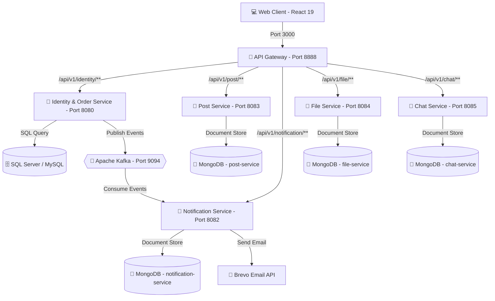

# 🛒 E-Commerce Microservices Platform

Hệ thống Thương mại Điện tử được phát triển theo kiến trúc **Microservices** hiện đại, sử dụng **Spring Boot 3 (Java 21)** cho backend, **React 19** cho frontend, kết hợp cơ sở dữ liệu quan hệ (SQL Server/MySQL), NoSQL (MongoDB) và Message Broker (Apache Kafka).

---

## 📐 Kiến trúc Hệ thống (Architecture Diagram)



---

## 🛠️ Công nghệ Sử dụng (Tech Stack)

### Backend Services
* **Language & Framework:** Java 21, Spring Boot `3.2.5`, Spring Cloud (`2023.0.4`)
* **API Gateway:** Spring Cloud Gateway
* **Service Communication:** OpenFeign, REST APIs
* **Event Streaming / Message Broker:** Apache Kafka (Spring Kafka)
* **Authentication & Authorization:** Spring Security, OAuth2 Resource Server, JWT (nimbus-jose-jwt / JJWT)
* **Object Mapping & Tools:** MapStruct `1.5.5`, Lombok `1.18.38`
* **Third-party Integration:** Brevo (Sendinblue) Email Service API

### Databases & Storage
* **Relational DB:** SQL Server / MySQL (Lưu trữ Đơn hàng, Sản phẩm, Người dùng, Giỏ hàng)
* **NoSQL DB:** MongoDB (Lưu trữ Bài đăng, Thông báo, Chat, Tệp phương tiện)
* **Local Storage:** Lưu trữ tệp phương tiện tải lên (File Storage)

### Frontend App
* **Framework:** React `19.1.1`
* **Routing:** React Router `v7.9.1`
* **Styling:** Sass (SCSS), Normalize.css
* **Tooling:** React App Rewired, Babel

---

## 📋 Danh sách Các Microservices & Config Ports

| Service Name | Port | Context Path | DB / Storage | Mô tả chức năng chính |
| :--- | :---: | :---: | :--- | :--- |
| **API Gateway** | `8888` | `/api/v1` | N/A | Điểm đầu vào chính (Routing, StripPrefix, Security Centralization) |
| **Identity & Order Service** | `8080` | `/identity` | SQL Server / MySQL (`dbBanHang`) | Xử lý Xác thực (JWT), Quản lý Người dùng, Sản phẩm, Đơn hàng, Giỏ hàng |
| **Post Service** | `8083` | `/post` | MongoDB (`post-service`) | Quản lý bài đăng, bài đánh giá sản phẩm |
| **Notification Service** | `8082` | `/notification` | MongoDB (`notification-service`) | Lắng nghe sự kiện từ Kafka & gửi email thông báo qua Brevo API |
| **File Service** | `8084` | `/file` | MongoDB (`file-service`) + Disk Storage | Tải lên, quản lý và phân phối tệp phương tiện (ảnh, tài liệu) |
| **Chat Service** | `8085` | `/chat` | MongoDB (`chat-service`) | Hệ thống trò chuyện / tư vấn thời gian thực giữa Khách hàng & Người bán |
| **Web App (Frontend)** | `3000` | N/A | N/A | Giao diện người dùng SPA (React 19) |

---

## 🚀 Hướng dẫn Cài đặt & Khởi chạy (Getting Started)

### 1. Yêu cầu Tiền đề (Prerequisites)
* **Java Development Kit (JDK):** Version 21 trở lên.
* **Node.js:** Version 18+ và **npm**.
* **Maven:** Version 3.8+ (hoặc dùng Maven Wrapper đi kèm).
* **Database Servers:**
  * **SQL Server** (hoặc **MySQL**) chạy tại `localhost:1433` (hoặc `3306`).
  * **MongoDB** chạy tại `localhost:27017`.
  * **Apache Kafka** chạy tại `localhost:9094`.

---

### 2. Thiết lập Cơ sở dữ liệu (Database Setup)
1. **SQL Database:**
   * Import tệp dữ liệu mẫu `dbBanHangSpringBoot.sql` vào SQL Server / MySQL.
   * Tên database mặc định: `dbBanHang`.
2. **MongoDB Databases:**
   * Các cơ sở dữ liệu MongoDB (`post-service`, `notification-service`, `file-service`, `chat-service`) sẽ tự động được khởi tạo khi dịch vụ khởi chạy.

---

### 3. Biến môi trường (Environment Variables)
Trước khi chạy hệ thống, hãy thiết lập các biến môi trường cần thiết (hoặc chỉnh sửa trong file `application.yaml` / `application.yml` của từng service):

```bash
# Cấu hình kết nối SQL Server (Dành cho order-service)
export DBMS_CONNECTION="jdbc:sqlserver://localhost:1433;databaseName=dbBanHang;encrypt=true;trustServerCertificate=true"
export DBMS_USERNAME="sa"
export DBMS_PASSWORD="your_password"

# Khóa ký JWT Token
export JWT_SIGNERKEY="baodeptrai16qTFQgn0y3Rw3U9oKO8Jn7gDxUi54jaB4mVGRwh1pkY7CQaDfgYfB"

# API Key gửi Email qua Brevo (Dành cho NotificationService)
export BREVO_API_KEY="your_brevo_api_key"
```

---

### 4. Khởi chạy Backend Microservices
Khởi chạy từng service theo thứ tự khuyến nghị:

1. **Khởi chạy Kafka & MongoDB** (Docker hoặc cài đặt cục bộ).
2. **Order Service (Identity & E-commerce Core):**
   ```bash
   cd order-service
   mvn spring-boot:run
   ```
3. **Post Service:**
   ```bash
   cd post-service
   mvn spring-boot:run
   ```
4. **File Service:**
   ```bash
   cd FileService
   mvn spring-boot:run
   ```
5. **Chat Service:**
   ```bash
   cd ChatService
   mvn spring-boot:run
   ```
6. **Notification Service:**
   ```bash
   cd NotificationService
   mvn spring-boot:run
   ```
7. **API Gateway:**
   ```bash
   cd api-gateway
   mvn spring-boot:run
   ```

---

### 5. Khởi chạy Frontend Web App
```bash
cd web-app
npm install
npm start
```
Ứng dụng Web sẽ tự động mở tại địa chỉ: `http://localhost:3000`.

---

## 📡 API Routing Overview (Cấu hình Route Gateway)

Tất cả các yêu cầu từ Web Client đều đi qua **API Gateway (Port 8888)** với tiền tố `/api/v1`:

* **Xác thực & Đơn hàng:** `http://localhost:8888/api/v1/identity/**`
* **Bài đăng:** `http://localhost:8888/api/v1/post/**`
* **Thông báo:** `http://localhost:8888/api/v1/notification/**`
* **Tệp tin / Media:** `http://localhost:8888/api/v1/file/**`
* **Chat / Trò chuyện:** `http://localhost:8888/api/v1/chat/**`

---

## 📁 Cấu trúc Thư mục Dự án (Project Structure)

```text
EcommerceWebsiteMicroService/
├── api-gateway/            # Spring Cloud Gateway Service (Port 8888)
├── order-service/          # Identity, Auth, Order & Product Core Service (Port 8080)
├── post-service/           # Product Post & Review Service (Port 8083)
├── NotificationService/    # Kafka Consumer & Email Notification Service (Port 8082)
├── FileService/            # Media File Storage & Download Service (Port 8084)
├── ChatService/            # Real-time Chat Service (Port 8085)
├── web-app/                # React 19 Frontend Application (Port 3000)
├── dbBanHangSpringBoot.sql  # Tệp SQL khởi tạo cơ sở dữ liệu ban đầu
└── README.md               # Tài liệu hướng dẫn dự án
```

---

## 🌟 Tính năng Chính (Key Features)

* ✅ **Kiến trúc Microservices độc lập:** Dễ dàng mở rộng (scale) từng dịch vụ riêng biệt.
* ✅ **Xác thực tập trung & An toàn:** Hệ thống JWT Token (Sign, Validate, Refresh) tích hợp với Spring Security.
* ✅ **Gửi thông báo bất đồng bộ:** Sử dụng Apache Kafka làm Event Broker truyền tải sự kiện tới Notification Service & gửi Email thông qua Brevo API.
* ✅ **Quản lý đa cơ sở dữ liệu:** Sử dụng linh hoạt SQL (SQL Server/MySQL) cho giao dịch và NoSQL (MongoDB) cho dữ liệu phi cấu trúc (post, chat, notify, files).
* ✅ **Quản lý Media:** Tải lên và phân phối ảnh sản phẩm/tệp tin qua FileService tích hợp API Gateway.
* ✅ **Giao diện người dùng hiện đại:** Ứng dụng React 19 mượt mà, hỗ trợ routing động và giao diện đáp ứng (responsive design).
